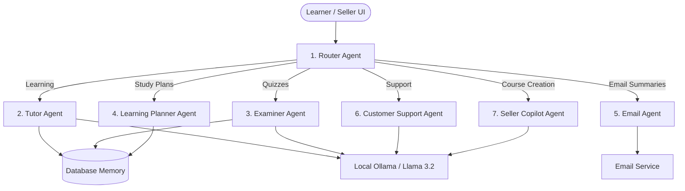

<div align="center">
  <h1>AdaptLearn Platform</h1>
  <p>
    <strong>A multi-agent e-learning marketplace powered by a Hybrid AI Architecture (Ollama Llama 3.2 & Google Gemini API).</strong>
  </p>
</div>

---

## 🔑 Quick Start & Demo Credentials

To explore the live demo or test locally, use the pre-configured credentials below:

- **Learner Account:** `L@demo.com` | Password: `Password123`
- **Seller Account:** `CS@demo.com` | Password: `Password123`

---

## Overview

**AdaptLearn** is a learning marketplace for anyone who wants to learn new skills or sell their own courses—ranging from financial literacy to practical tech skills.

Instead of a basic single-prompt chatbot, AdaptLearn uses a **7-agent autonomous AI network**. It is built on a **Hybrid AI Infrastructure**: it natively runs **100% locally and privately using Ollama (Llama 3.2)** for offline data privacy, with automatic failover to **Google Gemini API** when deployed to cloud environments. The system dynamically routes prompts, compresses chat history using **Context Retrieval (RAG)**, remembers student weaknesses across sessions, and generates structured course material on demand.



---

## 🤖 7 AI Helper Agents

AdaptLearn uses a custom AI service (`AiService`) that picks the best agent for your prompt:

1. **Router Agent:** Reads your message and sends it to the right helper.
2. **Tutor Agent:** Gives step-by-step explanations, breaks down lessons (useful information, finance, tech, life skills), and answers questions.
3. **Examiner Agent:** Creates quick quizzes, grades your answers, and points out areas to improve.
4. **Learning Planner Agent:** Looks at your past progress to build custom 30-day study plans.
5. **Email Agent:** Writes clean email summaries of lessons and sends them directly to your inbox.
6. **Customer Support Agent:** Answers questions about payments, refund rules, and using platform diamonds.
7. **Seller Copilot Agent:** Helps creators outline courses, build quiz questions, and write sales descriptions.

---

## 🧠 Memory & Retrieval Augmented Generation (RAG) Architecture

AdaptLearn implements a lightweight **RAG & Memory Retrieval pipeline**:

1. **Context Window Summarization:** When chat history exceeds 8 turns, the system compresses past conversation tokens while injecting persistent student weakness logs from Prisma DB into the prompt context.
2. **Dynamic Knowledge Injection:** The **Customer Support Agent** uses a RAG knowledge base containing exact platform exchange rates (0.077 - 0.12 MYR / Diamond), 14-day refund policies, and course catalog prices to guarantee 0% hallucination.
3. **Persistent Student Weakness Retrieval:** When the **Study Planner Agent** is invoked, it queries historical `AgentMemory` records to generate custom 30-day study roadmaps targeted at student weak points.

- **Smart Quizzes:** Automatically creates quizzes and highlights areas where you need more practice.
- **Personalized Memory:** Remembers your learning history and weak spots so recommendations improve over time.
- **Fast & Clean Chats:** Automatically condenses long chat histories so conversations stay fast without losing context.
- **Explore Any Topic:** Browse courses on useful information, finance tips, tech life skills, or summarized guides.
- **Diamond Wallet:** Easy payment with local eWallets (Master/Visa card, PayPal, Google Wallet, Bank Transfer,FPX, Grabpay, TNG, or Boost).
- **Chat & Email Summaries:** Message course sellers directly or ask the AI to email lesson summaries to your inbox.

### For Course Sellers

- **Sales Dashboard:** Track your earnings, course views, and completion rates in real time.
- **AI Copilot for Creators:** Use AI to instantly generate course outlines, lesson topics, and quiz questions.
- **Course Builder:** Easily create courses, set prices in diamonds, and add interactive quizzes.
- **Seller Inbox:** Reply to buyer questions and keep in touch with your community.

---

## Tech Stack

### AI Engine (100% Local & Private)
- **AI Model:** Runs **Llama 3.2** locally on your computer using [Ollama](https://ollama.com/).
- **AI Service:** Custom TypeScript backend (`AiService`) to route questions and manage chat memory.
- **Email Tool:** Nodemailer to send lesson summaries to your email.

### Frontend (Client)
- **Framework:** React 18 with [Vite](https://vitejs.dev/).
- **Styling:** Tailwind CSS v4.
- **UI Components:** Radix UI and Lucide React icons.
- **Charts:** Recharts for sales and progress graphs.
- **Routing:** React Router.

### Backend & Database
- **Server:** Node.js with Express (TypeScript).
- **Database:** SQLite managed with [Prisma ORM](https://www.prisma.io/).
- **Security:** JWT login tokens and Bcrypt password encryption.
- **Validation:** Zod schema validation.

---

## Project Structure

```text
📦 adaptlearn-platform
 ┣ 📂 backend                 # Express Server & Local AI Multi-Agent Service
 ┃ ┣ 📂 prisma              # Database models (User, AgentMemory, ChatSession, etc.)
 ┃ ┣ 📂 src
 ┃ ┃ ┣ 📂 controllers       # API Controllers
 ┃ ┃ ┣ 📂 routes            # API Routes (auth, chat, course, message, progress)
 ┃ ┃ ┣ 📂 services          # Multi-Agent Router & Ollama Integration (ai.service.ts)
 ┃ ┃ ┗ 📜 index.ts          # Express server entry point
 ┃ ┗ 📜 package.json
 ┣ 📂 src                     # React Frontend
 ┃ ┣ 📂 components          # UI components & dialogs
 ┃ ┣ 📂 contexts            # React state contexts
 ┃ ┣ 📂 pages               # App pages (AiLearning, SellerCopilot, CustomerService, Catalogue)
 ┃ ┣ 📜 App.tsx             # Main App layout
 ┃ ┗ 📜 main.tsx            # Frontend entry point
 ┣ 📂 image                   # Screenshots & graphics
 ┗ 📜 README.md
```

---

## Getting Started

### Prerequisites
- [Node.js](https://nodejs.org/) (v18+)
- [Ollama](https://ollama.com/) installed and running locally with the `llama3.2` model downloaded:
  ```bash
  ollama pull llama3.2
  ```

### 1. Backend Setup

```bash
cd backend

# Install dependencies
npm install

# Create environment file
echo 'DATABASE_URL="file:./dev.db"' > .env

# Set up the database with Prisma
npx prisma db push

# Start the backend server
npm run dev
```

### 2. Frontend Setup

Open a new terminal window in the main project folder:

```bash
# Install dependencies
npm install

# Start the Vite development server
npm run dev
```

### 3. Open in Browser

Open `http://localhost:5173` in your browser. Make sure Ollama is running in the background (`ollama serve`).

---

## License

This project is licensed under the [ISC License](LICENSE).
